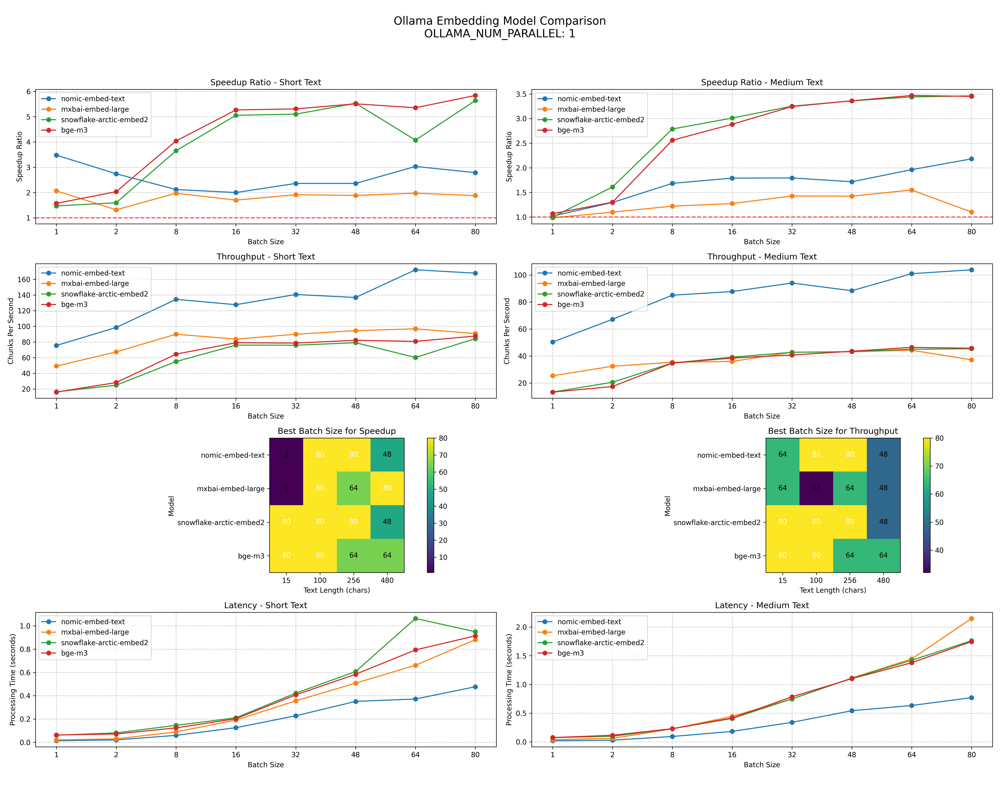

# Ollama Embedding Benchmark Tools

This repository contains tools for benchmarking and analyzing the performance of Ollama's embedding functionality. These tools help optimize batch sizes and parallel processing settings for deployments, with specific attention to text length and batch size performance characteristics.

## Overview

Three main scripts are provided:

1. **consistency.py**: Tests embedding consistency between individual and batch processing methods
2. **performance.py**: Measures performance (speed) differences between individual and batch processing
3. **text_length_benchmark.py**: Analyzes how text length affects embedding performance and optimal batch sizes

These tools are valuable for Site Reliability Engineers, DevOps engineers, and developers working with embedding models in environments, particularly for applications like vector similarity search services that utilizing vector embeddings.

## Example Results



## Requirements

- Python 3.7+
- Ollama (installed and running)
- The embedding model you wish to test (e.g., `nomic-embed-text`)

## Installation

1. Clone this repository:
```bash
git clone https://github.com/PaulCapestany/embed-tests.git
cd embed-tests
```

2. Install the required dependencies:
```bash
pip install ollama numpy python-dotenv scikit-learn matplotlib pandas
```

3. Ensure Ollama is installed and running:
```bash
# Start Ollama service if not already running
ollama serve
```

## Usage

### 1. Consistency Testing (consistency.py)

This script measures how consistent embeddings are when processed individually versus in batches.

```bash
# Set the embedding model to test
export EMBEDDING_MODEL=nomic-embed-text

# Run the consistency test
python consistency.py
```

#### What it does:

- Loads sample text from a file (`16-h.htm` by default)
- Chunks the text into segments of fixed size
- For each batch size:
  - Embeds each chunk individually
  - Embeds all chunks in a single batch
  - Compares the results using Euclidean distance and cosine similarity
- Visualizes the results showing average/max distances and average/min similarities
- Saves the visualization as `embedding_batch_performance.png`

#### Interpreting results:

- Lower Euclidean distances and higher cosine similarities indicate better consistency
- Currently only `OLLAMA_NUM_PARALLEL=1` provides consistent and reliable embeddings
- Larger batch sizes show degraded consistency depending on OLLAMA_NUM_PARALLEL setting

### 2. Performance Testing (performance.py)

This script measures the speed differences between individual and batch processing.

```bash
# Set the embedding model to test
export EMBEDDING_MODEL=nomic-embed-text

# Run the performance test
python performance.py
```

#### What it does:

- Loads and chunks sample text
- For each batch size:
  - Measures the time to process chunks individually
  - Measures the time to process chunks as a batch
  - Calculates speedup ratio and throughput metrics
- Runs multiple trials for statistical reliability
- Visualizes the results with four plots:
  - Execution time comparison
  - Batch processing speedup ratio
  - Throughput comparison (chunks per second)
  - Scaling efficiency (normalized throughput)
- Saves both the visualization and raw results as JSON

#### Interpreting results:

- Speedup ratio > 1.0 indicates batching is faster
- Throughput (chunks per second) shows practical processing capacity
- Look for the batch size where throughput plateaus (typically around 64)
- Batch sizes that provide speedup ratios of ~2x with good consistency are optimal

### 3. Text Length Benchmark (text_length_benchmark.py)

This script analyzes how different text lengths affect embedding performance and optimal batch size.

```bash
# Set the embedding model to test
export EMBEDDING_MODEL=nomic-embed-text

# Run the text length benchmark
python text_length_benchmark.py

# To test multiple models (comparative analysis)
python text_length_benchmark.py nomic-embed-text all-MiniLM-L6-v2
```

#### What it does:

- Tests multiple text lengths (15, 100, 256, 480 characters by default)
- For each text length, tests various batch sizes
- Measures performance metrics (speedup, throughput, latency)
- Visualizes results with multiple plots showing how text length affects:
  - Speedup ratios
  - Throughput (chunks/second)
  - Optimal batch sizes for different goals
  - Processing latency
- Generates a detailed text analysis with recommendations
- Can compare multiple models if specified as command-line arguments

#### Interpreting results:

- Different text lengths have different optimal batch sizes
- Short texts (15-100 chars) and long texts (256+ chars) have distinct performance characteristics
- The tool recommends specific batch sizes for different text lengths and use cases
- When comparing models, it ranks them by throughput and speedup efficiency

## Parameters

### Environment Variables

- `EMBEDDING_MODEL`: The Ollama model to use (e.g., `nomic-embed-text`)

### Script-Specific Parameters

#### consistency.py:
- `chunk_size`: Size of each text chunk (default: 256)
- `batch_sizes_list`: List of batch sizes to test (powers of 2 from 2 to 2048)

#### performance.py:
- `batch_sizes`: List of batch sizes to test
- `num_trials`: Number of test iterations for statistical reliability (default: 3)
- `max_chars`: Maximum text to process to limit test duration

#### text_length_benchmark.py:
- `text_lengths`: List of text lengths in characters to test (default: [15, 100, 256, 480])
- `batch_sizes`: List of batch sizes to test
- `num_trials`: Number of test iterations for statistical reliability (default: 2)
- Command-line arguments: List of models to test (e.g., `python text_length_benchmark.py nomic-embed-text mxbai-embed-large`)

## Troubleshooting

### Common Issues:

1. **Missing module error**:
   ```
   ModuleNotFoundError: No module named 'ollama'
   ```
   Solution: Install required dependencies with `pip install ollama`

2. **Ollama service not running**:
   ```
   ConnectionRefusedError: [Errno 111] Connection refused
   ```
   Solution: Start the Ollama service with `ollama serve`

3. **Model not found**:
   ```
   Error: model '<model_name>' not found
   ```
   Solution: Pull the model with `ollama pull <model_name>`

4. **Missing input file**:
   ```
   FileNotFoundError: [Errno 2] No such file or directory: '16-h.htm'
   ```
   Solution: Provide a text file for testing or the script will automatically generate sample text

5. **Other potential errors**:
   ```
   MemoryError: ...
   ```
   Solution: Reduce the `max_chars` parameter or the number of chunks being processed

## Best Practices

Based on comprehensive benchmark results, the following configurations are recommended:

### For Deployment

1. **Short Text (15-100 chars, e.g., search queries)**:
   - Use batch size 8-16 for optimal throughput
   - Set `OLLAMA_NUM_PARALLEL=8` or higher
   - Configure minimal batch wait times (20-50ms)

2. **Medium to Long Text (256+ chars, e.g., discussion content)**:
   - Use batch size 32-64 for optimal throughput
   - Configure longer batch wait times (100-300ms)

